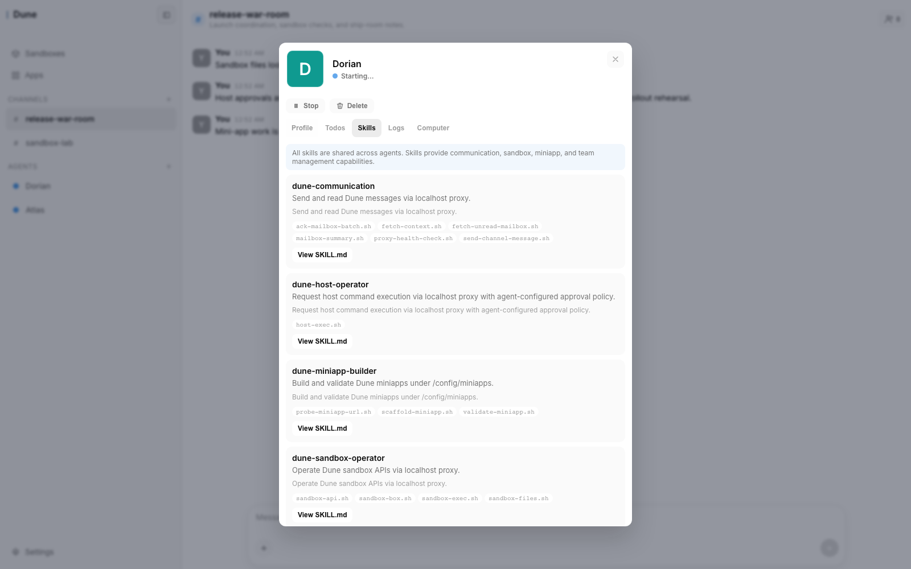

# Dune

Dune is a local-first agent workspace for coordinating agents, channels, sandboxes, and mini-apps from one UI.



## What Dune Does

- Organizes work in channels so humans and agents can coordinate around shared threads.
- Lets you create agents, start or stop them, inspect logs, manage todos, review skills, and open their computer view.
- Provides sandbox operations for lifecycle control, command execution, file browsing, uploads, downloads, and host-path import.
- Surfaces mini-apps built by agents in the same workspace.
- Keeps runtime state local with SQLite storage and BoxLite-backed sandboxes and agent runtimes.

## Quick Start

Prerequisites:

- Node.js 24
- `corepack` available for pnpm 9
- `make`

```bash
git clone <repo-url>
cd dune
corepack enable
make deploy
make run
```

Open [http://localhost:3100](http://localhost:3100).

`make deploy` installs dependencies, creates `.env` from `.env.example` if needed, and builds all packages. Before agents can actually respond, configure a model provider in `Settings > Model`.

## Common Commands

| Command | What it does |
| --- | --- |
| `make deploy` | Install dependencies, create `.env` if missing, and build the app. |
| `make test` | Run the backend test suite. |
| `make check` | Run the pre-PR validation gate: build plus backend tests. |
| `make run` | Start the app with the built frontend assets. |
| `make clean` | Remove build and dev artifacts while keeping local runtime data. |

## Development Mode

Use the split backend/frontend workflow when you want live frontend iteration or to follow the sandbox manual checklist.

1. Build dependencies once:

```bash
make deploy
```

2. Start the backend from the repo root:

```bash
PORT=3100 DATA_DIR=./test-results/manual-checks/data pnpm --filter @dune/backend dev
```

3. Start the frontend dev server in another terminal:

```bash
pnpm --filter @dune/frontend dev -- --host localhost --port 4173
```

4. Open [http://localhost:4173](http://localhost:4173).

## Monorepo Layout

- `packages/frontend`: Lit-based SPA, workspace shell, agent views, sandbox UI, and apps UI.
- `packages/backend`: Hono server, WebSocket layer, SQLite stores, agent orchestration, and sandbox APIs.
- `packages/shared`: shared schemas and types used by both frontend and backend.

## Data and Configuration

- `DATA_DIR` defaults to `./data` and relocates the full runtime data root.
- The SQLite database lives at `data/db/dune.db`.
- Agent files live under `data/agents/`.
- BoxLite state is exposed at `data/boxlite/`; the runtime also uses the shorter `data/b/` path internally to avoid Unix socket path limits.
- `PORT` defaults to `3100`.
- `ADMIN_PORT` defaults to `PORT + 1` and binds the admin plane to `127.0.0.1`.
- `FRONTEND_DIST_PATH` defaults to `./packages/frontend/dist`; `make run` serves the built SPA from there.
- Local tool state in `.claude/` and `.codex/`, runtime data in `data/`, and generated artifacts such as `dist/`, `test-results/`, `coverage/`, `.release/`, and `packages/backend/.port` are intentionally local-only and git-ignored.
- If you want an isolated run for manual checks or demos, point `DATA_DIR` at another ignored path such as `./test-results/manual-checks/data`.

## Further Reading

- [Sandboxes UI Manual Verification Checklist](docs/sandboxes-ui-manual-checklist.md)
- [Deployment Function UI Design](docs/deployment-function-ui-design.md)
